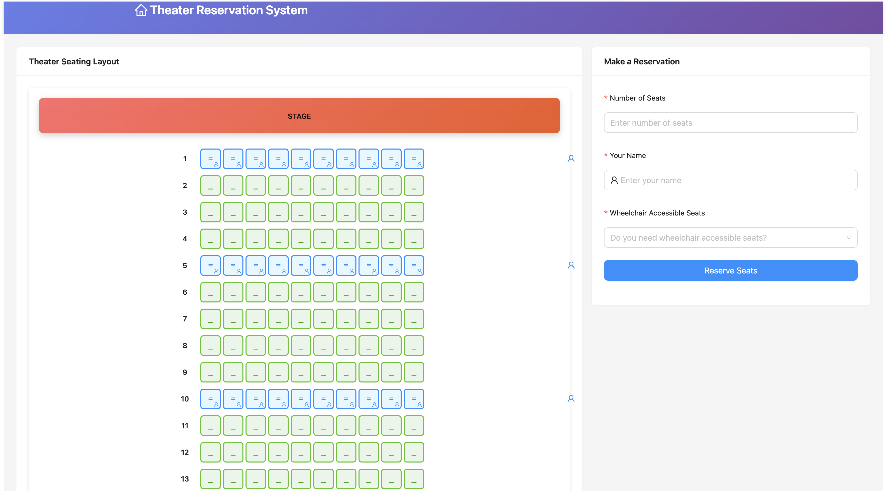
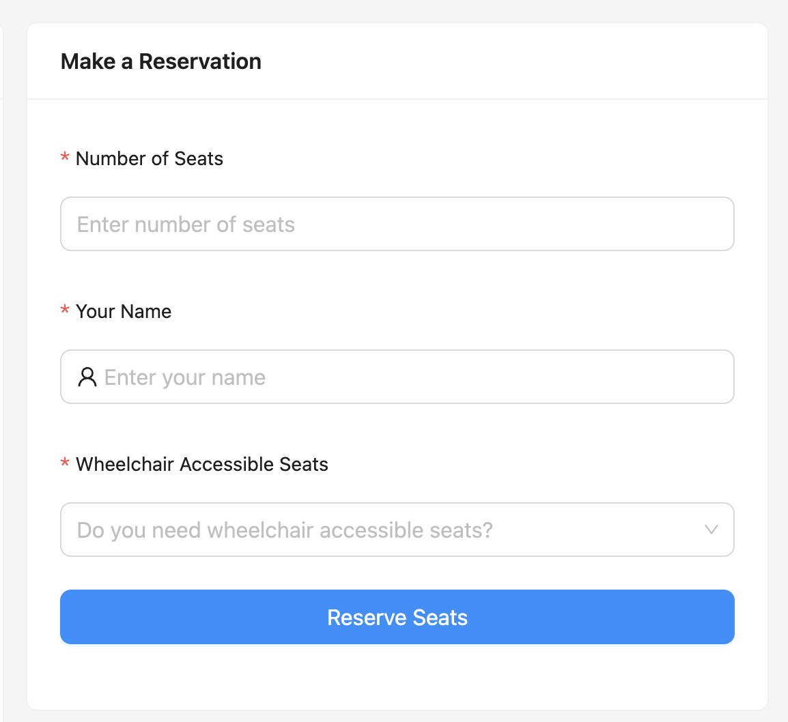
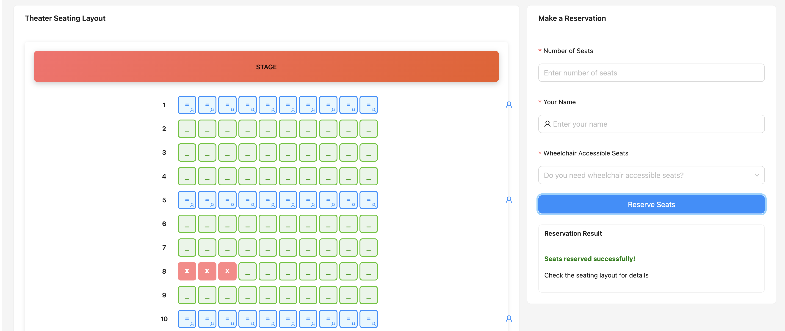

# Theater Reservation System

A full-stack theater seat reservation system with React frontend and Spring Boot backend, featuring wheelchair accessibility support.

## Features

- 🎭 **Interactive Web UI** - Modern React-based user interface
- 🪑 **Smart Seat Selection** - Automatic best seat assignment
- ♿ **Accessibility Support** - Wheelchair accessible seating
- 📱 **Responsive Design** - Works on desktop and mobile
- 🔄 **Real-time Updates** - Live seating layout updates
- ✅ **Complete Testing** - Unit tests and code coverage

## Screenshots

| Feature | Screenshot | Description |
|---------|------------|-------------|
| **Theater Layout** |  | Interactive seat selection interface |
| **Reservation Form** |  | User-friendly booking form |
| **Success Message** |  | Confirmation of successful booking |

## Project Structure

```
theater-reservation-system/
├── backend/                 # Spring Boot backend
│   ├── src/main/java/      # Java source code
│   ├── src/test/java/      # Test code
│   └── build.gradle        # Build configuration
├── frontend/               # React frontend
│   ├── src/               # React components
│   ├── public/            # Static assets
│   └── package.json       # Dependencies
└── screenshots/           # UI screenshots
```

## Tech Stack

### Backend
- **Java 17+** with Spring Boot 3.1
- **Gradle** build system
- **H2 Database** (in-memory)
- **RESTful API** with JSON responses
- **CORS** enabled for frontend integration

### Frontend
- **React 18** with modern hooks
- **Ant Design** UI components
- **Axios** for API communication
- **Responsive CSS** for mobile support

## Quick Start

### Prerequisites
- Java 17 or higher
- Node.js 16 or higher
- Git

### Backend Setup
```bash
# Set Java 17 (if you have multiple Java versions)
export JAVA_HOME=/path/to/java17

# Build and run Spring Boot application
./gradlew bootRun
```

The backend will start at `http://localhost:8080`

### Frontend Setup
```bash
# Navigate to frontend directory
cd frontend

# Install dependencies
npm install

# Start development server
npm start
```

The frontend will start at `http://localhost:3000`

## API Endpoints

### Theater Information
- `GET /api/theater` - Get theater details and seating layout
- `GET /api/seating` - Get current seating arrangement

### Reservations
- `POST /api/reserve` - Reserve seats
  ```json
  {
    "numSeats": 3,
    "personName": "John Doe",
    "needsAccessible": false
  }
  ```

## Project Structure

```
theater-reservation-system/
├── src/main/java/
│   ├── TheaterReservationApplication.java
│   ├── controller/
│   │   └── TheaterController.java
│   ├── service/
│   │   └── TheaterService.java
│   ├── dto/
│   │   ├── ReservationRequest.java
│   │   ├── ReservationResponse.java
│   │   ├── SeatDto.java
│   │   ├── RowDto.java
│   │   └── TheaterDto.java
│   └── model/
│       ├── Theater.java
│       ├── Row.java
│       ├── Seat.java
│       └── ReservationsService.java
├── frontend/
│   ├── src/
│   │   ├── components/
│   │   │   ├── TheaterLayout.jsx
│   │   │   └── ReservationForm.jsx
│   │   ├── services/
│   │   │   └── theaterService.js
│   │   └── App.js
│   └── package.json
├── backend/
│   ├── server.js
│   └── package.json
└── build.gradle
```

## Core Features

### Smart Seat Assignment
The system automatically finds the best available seats based on:
- **Proximity to center row** - Prioritizes seats closer to the center
- **Consecutive availability** - Ensures all requested seats are together
- **Accessibility requirements** - Filters for wheelchair-accessible rows when needed

### Wheelchair Accessibility
- Rows 1, 5, and 10 are wheelchair accessible
- System automatically detects and assigns accessible seats when requested
- Visual indicators show accessible seating options

### Real-time Updates
- Live seating layout updates after reservations
- Immediate feedback on reservation success/failure
- Interactive seat selection with visual feedback

## Testing

### Backend Tests
```bash
# Run Spring Boot tests
./gradlew test

# Run with coverage
./gradlew jacocoTestReport
```

### Frontend Tests
```bash
cd frontend
npm test
```

## Development

### Adding New Features
1. **Backend**: Add new endpoints in `TheaterController`
2. **Frontend**: Create new components in `src/components/`
3. **Integration**: Update `theaterService.js` for API calls

### Code Quality
- **PMD** static analysis for Java code
- **JaCoCo** code coverage reporting
- **ESLint** for JavaScript/React code

## Deployment

### Production Build
```bash
# Backend
./gradlew bootJar

# Frontend
cd frontend
npm run build
```

### Docker Support (Optional)
```dockerfile
# Backend Dockerfile
FROM openjdk:17-jdk-slim
COPY build/libs/*.jar app.jar
EXPOSE 8080
ENTRYPOINT ["java", "-jar", "/app.jar"]
```

## Contributing

1. Fork the repository
2. Create a feature branch
3. Make your changes
4. Add tests for new functionality
5. Submit a pull request

## License

This project is licensed under the MIT License.

## Team

- **Qiyuan Zhu** - Main application & Spring Boot integration
- **Shaohua Guo** - Core business models (Theater, Row, Seat)
- **Yitian Xu** - Reservation service logic